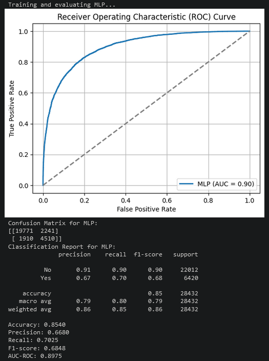

# RainPrediction
The project implements multiple different learning models to determine if rain will occur tomorrow 
in a certain area of Australia based on climate statistics. The data is formed by over a hundred 
thousand collected weather statistics, and whether or not it rained the day after these readings 
were taken. The code implements models such as Naive Bayes, MLP, and Logistic Regression.

Sample Output:

